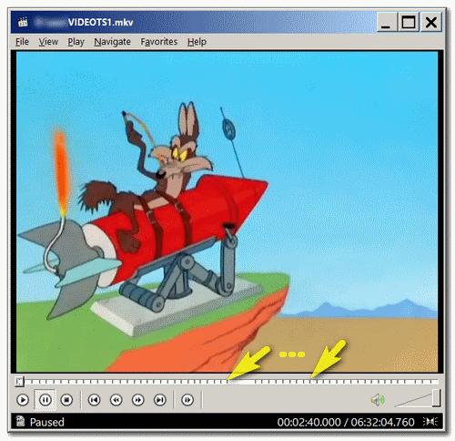
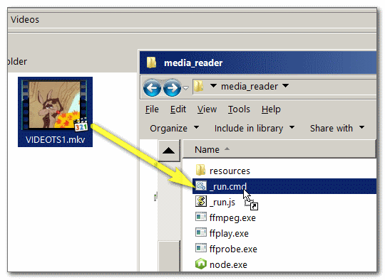
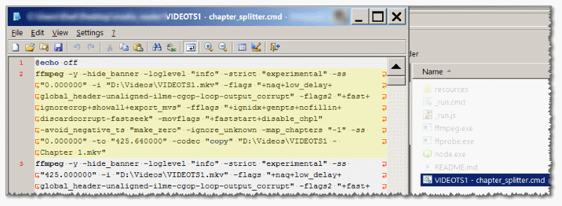

<h1><em>Chapter Splitter</em> - &nbsp; &nbsp; </h1>

Video chapters are a nice way to identify a start/end of new contextual-segments in a long-video. 

In case you've used of a ripping program such as <a href="https://handbrake.fr/nightly.php"> HandBrake</a>, 
you'll end up with a one long video, containing all the videos on the DVD, 
if it is not desirable for you, you may use this <em>Chapter Splitter</em> to split the one long video into many short ones, 
accurately cut by the chapter's start and end points.

<em>Chapter Splitter</em> uses FFPROBE for the chapter information, in a JSON format, 
feeded into the NodeJS engine to render a long-list of FFMPEG commands, 
that will split the long video, but will not re-encode it (<em>muxing</em>), 
this should end up very fast, and playable in most devices - and with the same quality! 

<em>It is advisable that you'll <a href="https://github.com/eladkarako/ffmpeg/">re-encode the video</a> at some point or upload it to YouTube, (which will do it itself) in-order to fix the video-index.</em>

<h3>How To Use?</h3>

You'll drag&amp;drop your media over <code>_run.cmd</code> and it will generate a new CMD file, 
run it and all the work will be done for you. 

When you'll run the CMD file, 
the new videos will be placed in the same folder as the original video, 
their names will be the original file name with a suffix of the chapter name (or "Chapter " with the chapter id in-case title is not available). 

No encoding is actually done in <em>Chapter Splitter</em>, 
you can run the generated CMD file when you'll want to. 

In order to provide a complete solution (with binaries included), 
I've <a href="https://upx.github.io">UPX</a>-compressed the exe files. 
FFMPEG are about 40MB but now are about 14MB (and nodejs goes from about 20MB to 5MB). 
Some antivirus programs do not like upx, I think it's cool. 

<h3>Updating?</h3>
FFMPEG/FFPROBE can be downloaded from here: 
<a href="https://ffmpeg.zeranoe.com/builds/win32/static/ffmpeg-latest-win32-static.zip">https://ffmpeg.zeranoe.com/builds/win32/static/ffmpeg-latest-win32-static.zip</a> or   
here: <a href="https://ffmpeg.zeranoe.com/builds/win64/static/ffmpeg-latest-win64-static.zip">https://ffmpeg.zeranoe.com/builds/win64/static/ffmpeg-latest-win64-static.zip</a> 

NodeJS can be downloaded from here: 
<a href="https://nodejs.org/download/nightly/v10.0.0-nightly20171117959c425a19/win-x86/node.exe">https://nodejs.org/download/nightly/v10.0.0-nightly20171117959c425a19/win-x86/node.exe</a> 
for x64 bit get the <code>node.exe</code> from the <code>win-x64/</code> folder instead. 
And browse <a href="https://nodejs.org/download/nightly/">https://nodejs.org/download/nightly/</a> for a more recent builds. 
